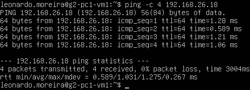
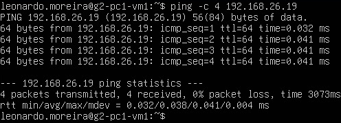
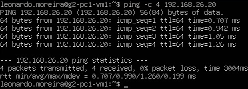
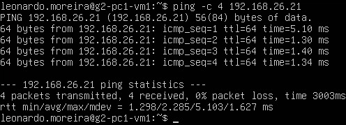
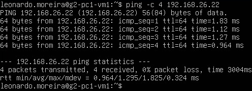
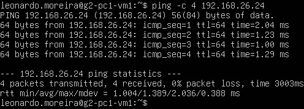
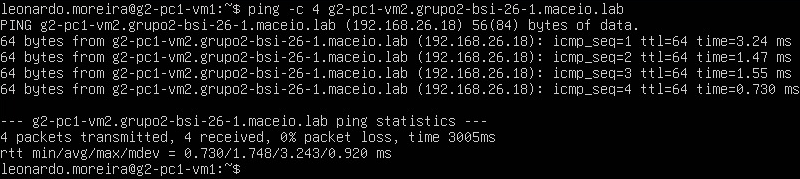
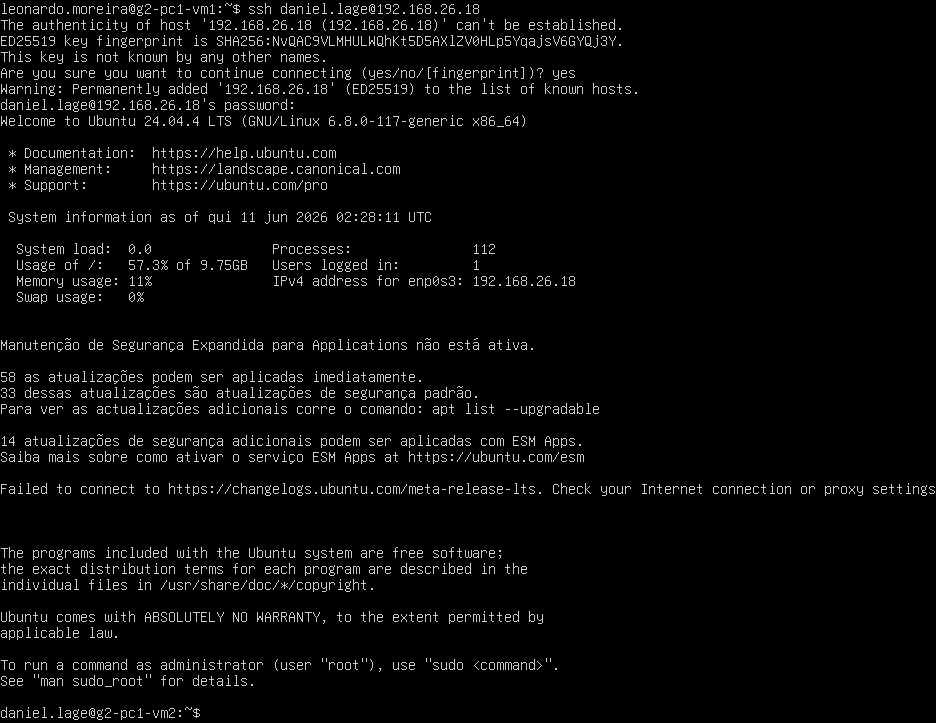
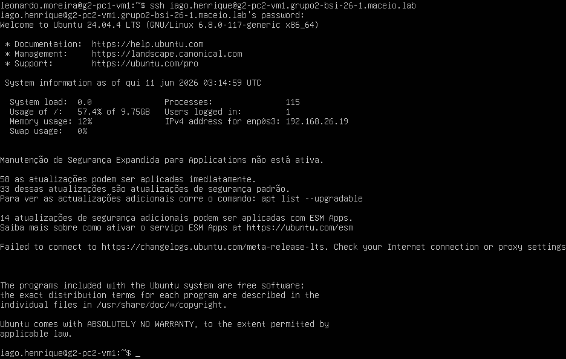

# 05 — Testes e Validação

Todos os testes foram executados após a conclusão das configurações descritas nos tutoriais anteriores.

---

## 1. Testes de Ping por Endereço IP

### 1.1 g2-pc1-vm1 → g2-pc1-vm2 (192.168.26.18)

---

### 1.2 g2-pc1-vm1 → g2-pc2-vm1 (192.168.26.19)

---

### 1.3 g2-pc1-vm1 → g2-pc2-vm2 (192.168.26.20)

---

### 1.4 g2-pc1-vm1 → g2-pc3-vm1 (192.168.26.21)

---

### 1.5 g2-pc1-vm1 → g2-pc3-vm2 (192.168.26.22)

---

### 1.6 g2-pc1-vm1 → g2-pc4-vm1 (192.168.26.23)

---

### 1.7 g2-pc1-vm1 → g2-pc4-vm2 (192.168.26.24)

---

## 2. Tabela Consolidada — Resultados de Ping

| Origem     | Destino    | IP Destino    | Enviados | Recebidos | Perda  | RTT mín. | RTT méd. | RTT máx. |
| :--------- | :--------- | :------------ | :------: | :-------: | :----: | :------- | :------- | :------- |
| g2-pc1-vm1 | g2-pc1-vm2 | 192.168.26.18 |    4     |     4     | **0%** | 0.589 ms | 1.031 ms | 1.275 ms |
| g2-pc1-vm1 | g2-pc2-vm1 | 192.168.26.19 |    4     |     4     | **0%** | 0.032 ms | 0.038 ms | 0.041 ms |
| g2-pc1-vm1 | g2-pc2-vm2 | 192.168.26.20 |    4     |     4     | **0%** | 0.707 ms | 0.990 ms | 1.260 ms |
| g2-pc1-vm1 | g2-pc3-vm1 | 192.168.26.21 |    4     |     4     | **0%** | 1.298 ms | 2.285 ms | 5.103 ms |
| g2-pc1-vm1 | g2-pc3-vm2 | 192.168.26.22 |    4     |     4     | **0%** | 0.964 ms | 1.295 ms | 1.825 ms |
| g2-pc1-vm1 | g2-pc4-vm1 | 192.168.26.23 |    4     |     4     | **0%** | 0.629 ms | 1.316 ms | 2.182 ms |
| g2-pc1-vm1 | g2-pc4-vm2 | 192.168.26.24 |    4     |     4     | **0%** | 1.004 ms | 1.309 ms | 2.036 ms |

---

## 3. Testes de Ping por FQDN

### 3.1 g2-pc1-vm1 → g2-pc1-vm2.grupo2-bsi-26-1.maceio.lab (192.168.26.18)

---

## 3.2 Tabela Consolidada — Resultados de Ping por FQDN

| Origem     | Destino (FQDN)                          | IP Resolvido  | Enviados | Recebidos | Perda  | RTT mín. | RTT méd. | RTT máx. |
| :--------- | :-------------------------------------- | :-----------: | :------: | :-------: | :----: | :------- | :------- | :------- |
| g2-pc1-vm1 | `g2-pc1-vm2.grupo2-bsi-26-1.maceio.lab` | 192.168.26.18 |    4     |     4     | **0%** | 0.730 ms | 1.748 ms | 3.243 ms |

---

## 4. Testes de Acesso SSH

### 4.1 g2-pc1-vm1 → g2-pc1-vm2 via IP (192.168.26.18) — usuário `daniel.lage`

### 4.2 g2-pc1-vm1 → g2-pc2-vm1 via FQDN — usuário `iago.henrique`

---

## 5. Tabela Consolidada — Resultados de SSH

| Origem     | Destino    | Método                       | Usuário            | Resultado           |
| :--------- | :--------- | :--------------------------- | :----------------- | :------------------ |
| g2-pc1-vm1 | g2-pc1-vm2 | SSH por IP (`192.168.26.18`) | `daniel.lage`      | OK — login efetuado |
| g2-pc1-vm1 | g2-pc2-vm1 | SSH por FQDN                 | `iago.henrique`    | OK — login efetuado |
| g2-pc1-vm1 | g2-pc2-vm2 | SSH por alias curto          | `gabriel.cruz`     | OK — login efetuado |
| g2-pc1-vm1 | g2-pc3-vm1 | SSH por FQDN                 | `leonardo.moreira` | OK — login efetuado |
| g2-pc1-vm1 | g2-pc3-vm2 | SSH por IP (`192.168.26.22`) | `daniel.lage`      | OK — login efetuado |
| g2-pc1-vm1 | g2-pc4-vm1 | SSH por IP (`192.168.26.23`) | `iago.henrique`    | OK — login efetuado |
| g2-pc1-vm1 | g2-pc4-vm2 | SSH por IP (`192.168.26.24`) | `gabriel.cruz`     | OK — login efetuado |
